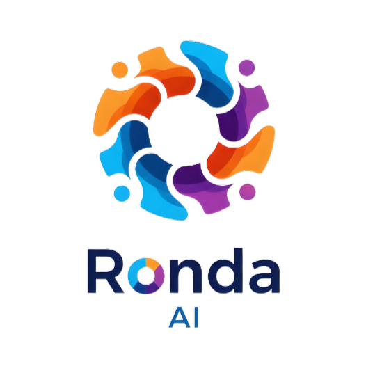

  <a href="README.es.md">Ver en Español</a>

 

  
  <h1 align="center">Ronda AI: Your AI Pedagogical Assistant</h1>
  

    An open-source tool designed to transform classroom dynamics, boost participation, and empower educators with the power of generative AI.
  

  

    
    
    
    
    
    
    
    
  

  

    <a href="https://github.com/ronda-ai/ronda-app/blob/main/docs/FEATURES.md" target="_blank">View Features</a> •
    <a href="https://github.com/ronda-ai/ronda-app/blob/main/docs/DEPLOYMENT.md" target="_blank">Deployment</a> •
    <a href="https://github.com/ronda-ai/ronda-app/blob/main/docs/CONTRIBUTING.md" target="_blank">Contribute</a>
  

  

    
  

---

## 🚀 What is Ronda AI?

 

 

**Ronda AI** is an open-source pedagogical assistant that uses generative AI to help educators create a more dynamic, inclusive, and personalized learning environment. The application goes beyond simple gamification; it's a tool to understand, support, and empower each student individually and collectively.

The heart of the application is an interactive "wheel," but its true power lies in the layers of intelligence and analysis surrounding it. As a self-hosted tool, it guarantees **total data sovereignty**: your students' information belongs only to you and resides on your own infrastructure.

Built with the latest web technologies like Next.js, Ronda AI is designed from the ground up to be a **potential Progressive Web App (PWA)**. While it is currently a web application, its architecture lays the groundwork to deliver a native app-like experience. This would allow educators to "install" it on their computers, tablets, or phones for quick access and, most importantly, enable **offline functionality**. This offline capability is crucial for classrooms with unstable internet connectivity, ensuring the tool can remain functional and reliable at all times.

[**➡️ Explore all features in detail**](./docs/FEATURES.md)

## ✨ Key Features

*   🎡 **Intelligent Participation Wheel**: Switch between random selection, AI-weighted mode to balance participation, manual selection, or pairs.

*   🧠 **AI Pedagogical Coach**: Receive student profile analysis, personalized support plans, strategies for fear management, and consult an AI expert for detailed guidance.

*   🔬 **Social Dynamics Lab**: Analyze and improve student relationships with intervention plans to resolve conflicts and strategies to foster social integration.

*   🎨 **Pedagogical Tool Generator**: Instantly create curriculum activities, evaluation rubrics, full tests from any topic, and adapt existing resources for different classroom contexts.

*   🌐 **Inclusive Language Support**: Generate bilingual support materials (text and audio) to assist students who are learning the main language of instruction.

*   🛡️ **Digital Citizenship Tools**: Generate dynamics to teach netiquette, simulate digital conflicts for teacher training, and create negotiable conviviality pacts for the classroom.

*   🕹️ **AI Games Playground**: Energize the class with games like "Riddle Battle," "Lightning Rounds," and a "Collaborative Storytelling" mode that turns stories into multi-voice audiobooks.

*   📊 **Analytics and Data Management**: Visualize attendance and participation trends over time, export all data in open formats (CSV, JSON), and monitor your instance's storage usage.

## 🎓 PBL Lab: Your Project-Based Learning Co-Pilot

Ronda AI features a dedicated **PBL Lab**, a powerful module designed to guide educators and students through the entire lifecycle of a Project-Based Learning (PBL) project. The lab streamlines planning, team formation, and evaluation, turning complex projects into manageable, engaging experiences.

*   **Project Planning**: Transforms a simple topic into a comprehensive project plan, generating an essential question, phases, milestones, and final products.
*   **Strategic Team Formation**: Creates student groups using AI, based on criteria like "balanced skills," "social remediation," or "interest synergy."
*   **On-the-Fly Scaffolding**: When a team gets stuck, the AI generates a "micro-activity" to unblock them and provides the teacher with guiding questions.
*   **360° Evaluation**: Generates detailed rubrics for the final product and the teamwork process.

[**➡️ Learn more about the PBL Lab**](./docs/FEATURES-PBL.md)

## 🛡️ School Safety Lab: Your Command Center for Prevention

Ronda AI includes a dedicated **School Safety Lab**, a comprehensive module for the **proactive management of safety and well-being** in the educational environment. It goes beyond simple incident reaction; it's a command center for diagnosis, planning, training, and organization of school safety.

*   **Risk Diagnosis**: Provide context about your school's location, infrastructure, and social dynamics to generate an AI-prioritized **risk map**.
*   **Action Protocols**: Create **step-by-step action plans** (Before, During, and After) for specific risks like earthquakes, fires, or bullying.
*   **Crisis Simulation**: Train your decision-making skills in an **interactive crisis simulator**. Define a scenario, include students for realism, and navigate the situation while receiving feedback and a score.
*   **Safety Committees**: Organize your students and staff into **safety brigades**, such as "First Aid" or "Evacuation," to assign clear roles and responsibilities.

[**➡️ Learn more about the School Safety Lab**](./docs/FEATURES-SAFETY.md)

## 💡 Teacher Lab: Your Private Space for Professional Growth

Ronda AI introduces the **Teacher Lab**, a private module designed to be a personal AI assistant for professional development. This space, explicitly linked to the Chilean **"Marco para la Buena Enseñanza" (MBE)**, offers tools for self-evaluation, planning, and reflective practice.

*   **Classroom Pulse**: Get an AI-generated summary of your class's current strengths and challenges, tagged with relevant MBE criteria.
*   **Planning Co-pilot**: Describe a learning objective and receive a "pedagogical menu" with three different class plans, each justified with MBE criteria.
*   **Classroom Climate Simulator**: Practice handling common classroom management situations in a safe, interactive simulation that provides feedback based on the MBE.
*   **MBE Expert**: Ask any question about the "Marco para la Buena Enseñanza" and get an answer generated by an AI expert that has studied the official document.
*   **Guided Reflection Assistant**: Engage in a Socratic dialogue with an AI coach. Write your thoughts on a class, and the AI will ask insightful questions to deepen your reflection, always connecting back to the MBE framework.

[**➡️ Learn more about the Teacher Lab**](./docs/FEATURES-TEACHER-LAB.md)

## 💡 From Raw Data to Actionable Wisdom: The AI Core

Ronda AI is more than just a collection of features; it's an intelligent system designed to act as a true pedagogical co-pilot. At its heart lies a sophisticated architecture built on **Genkit**, Google's open-source framework for building production-ready AI applications. This allows us to orchestrate complex chains of reasoning, which we call "AI Flows."

Here’s how it works:

1.  **Contextual Anonymization**: When a teacher requests an analysis (like a "Coach Suggestion"), the system gathers all relevant, encrypted data about a student—their performance, fears, observations, and social relationships. This data is then anonymized, replacing real names with aliases like "Student A."

2.  **Structured AI Flows**: The anonymized data is fed into a specific AI Flow. These flows are not simple prompts; they are structured programs that instruct the language model to act as an expert (e.g., a child psychologist or curriculum designer). Using Zod schemas, we force the model to return a predictable, structured JSON object, not just a block of text.

3.  **De-Anonymization & Delivery**: The AI returns a structured analysis based on the anonymous data. Ronda AI then de-anonymizes the response, replacing aliases with the correct names, and presents it to the teacher as a clean, actionable insight.

This process transforms seemingly disconnected data points into profound pedagogical wisdom, democratizing access to expert-level analysis and empowering every educator to provide deeply personalized support, all while ensuring student privacy remains paramount.

## 🔐 Privacy and Security by Design

The confidentiality and sovereignty of student data are Ronda AI's top priorities.

*   **Data Sovereignty (Self-Hosting)**: Unlike cloud platforms, you control the server. The database, files, and all application logic reside on your own infrastructure (whether on Vercel, a private server, or your local machine). **Your data is never shared with third parties**.

*   **Encryption at Rest**: All sensitive information stored in the database, such as student names, notes, fears, observations, and evaluations, is **encrypted**. This means that even if someone gained unauthorized access to the database files, they could not read your students' personal information.

*   **Anonymization for AI**: When an external language model (like Google's Gemini) needs to be consulted, Ronda AI **does not send real names**. Instead, the application replaces student names with generic, anonymous aliases like "Student A," "Student B," etc. Once the AI returns a response, the application substitutes the aliases back with the real names, ensuring no personally identifiable information leaves your server.

## 🌐 Localization and Community Translations

To make Ronda AI accessible to educators worldwide, the application has been translated into multiple languages using generative AI. These include English, Spanish, Portuguese, French, German, Simplified Chinese, Japanese, Russian, Italian, Polish, Dutch, Korean, Hindi, and Indonesian.

However, AI-generated translations may contain errors or lack the natural, cultural nuance of a native speaker. **We strongly encourage community contributions** to help refine and improve these translations. If you are a native speaker, please consider helping us make Ronda AI a better tool for your community.

[**➡️ Learn how to contribute to translations**](./docs/CONTRIBUTING.md#translations-and-localization)

## 🤖 Language Models: Gemini (Default), OpenAI, and More

Ronda AI is built to be flexible, supporting multiple generative AI models.

*   **Google Gemini (Default & Recommended)**: The application is optimized to use Google's **Gemini** models out of the box, offering a powerful and cost-effective solution. You can start for free with the Google AI Studio free tier.

*   **OpenAI, Grok, DeepSeek, and Ollama**: Ronda AI also supports other popular models. You can easily switch to **OpenAI** (e.g., GPT-4o), **xAI** (Grok), or **DeepSeek** by providing the corresponding API key. Additionally, you can connect to any locally-run model through **Ollama**.

[**➡️ See the full guide on configuring Language Models**](./docs/DEPLOYMENT.md#configuring-the-language-model-llm)

## 🗄️ Database: MongoDB (Default) & Supabase (Experimental)

Ronda AI offers flexibility in its data backend, supporting both MongoDB and Supabase.

*   **MongoDB (Default)**: The primary and recommended database is **MongoDB**, a NoSQL database. Its flexible, document-based model is ideal for the evolving and complex data structures of a pedagogical tool, allowing for rich student profiles and nested data without rigid schemas. The application is fully optimized for MongoDB.

*   **MongoDB Atlas Vector Search (Required for MBE Expert)**: The "MBE Expert" feature in the Teacher Lab requires a MongoDB Atlas Search Index to perform vector-based similarity searches on the MBE document. This feature is only available on MongoDB's cloud service, Atlas, and will not work on local or self-hosted MongoDB instances. See the [**deployment guide**](./docs/DEPLOYMENT.md#setting-up-the-vector-search-index-for-mbe-expert) for mandatory setup instructions.

*   **Supabase (Experimental)**: We are actively developing support for **Supabase**, an open-source alternative to Firebase that uses a PostgreSQL relational database. This option is for developers who prefer a SQL-based structure. Please note that **Supabase integration is not yet complete and should be considered experimental.**

## 📜 Disclaimer and Notice of Responsibility

Ronda AI is provided as open-source, self-hosted software. This means you have full control over your data, but also full responsibility for its security. While the app includes strong encryption, you are responsible for securing your hosting environment, database, and secret keys. The project creators are not liable for any data breaches resulting from your infrastructure.

[**➡️ Read the full Disclaimer and Notice of Responsibility**](./docs/TERMS.md)

## 🚀 Getting Started

The easiest way to get started is by deploying your own free instance on Vercel.

    

If you prefer full control and want to host it yourself, we have a detailed guide for local installation.

[**➡️ See Full Deployment Guide**](./docs/DEPLOYMENT.md)

## 🤝 Contributing

Ronda AI is a community-driven project. If you are a developer, educator, designer, or just someone passionate about improving education, your contribution is welcome.

*   [**Contribution Guide**](./docs/CONTRIBUTING.md): Learn how you can contribute to the project.
*   [**Code of Conduct**](./docs/CODE_OF_CONDUCT.md): Our guidelines for a safe and respectful community.

Together we can build an ecosystem of tools that truly serve our communities!

## 👥 Contributors

A huge thank you to all the people who have contributed to Ronda AI! You can see all contributors here:

Made with <a href="https://contrib.rocks">contrib.rocks</a>.

## ✨ Sponsors

If Ronda AI has been useful to you, please consider sponsoring the project to support its continued development. Your sponsorship helps cover server costs, development time, and new features.

You can sponsor the project through [**GitHub Sponsors**](https://github.com/sponsors/ronda-ai).

<!-- Add your sponsor logos here -->
<!-- 

  

 
-->
